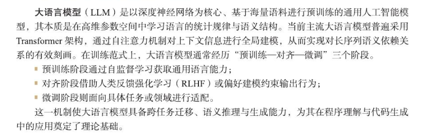

# AI Coding的概念（5.17）

**目标**：模拟，扩展，增强人类智能活动

**底层**：深度学习  预训练  自监督学习   卷积神经网络  循环神经网络  提示词驱动  上下文理解

**能力**： 语言理解  生成能力  多任务推理与生成

**特点**：效率高  质量高  门槛低

**应用场景**：Web系统开发  数据分析  科研原型构建  教学辅助

#### 大语言模型

目前在生产上实现了 “ 辅助编程 ”到“ 自主协作式编程 ”的转变

#### 在变成场景中

具体而言,模型首先理解任务目标与约束条件,其次在内部表示中构建候选实现
路径,最后生成符合语法与语义约束的代码片段。这一过程依赖于**上下文建模能力**、**概率生成机制**与**隐式知识迁移能力**,使模型能够完成**代码补全**、**函数生成**、**错误修复**与**重构建议**等任务。

**流程：需求表达——语义理解——代码生成——反馈优化** 

1. promote阶段： 通过**描述需求** ，**约束条件** ， **目标功能**，**作为认知**与大语言模型之间的接口，承担着将抽象意图映射为可计算语义表达的作用
2. generate阶段： 根据promote生成相应的**代码结构，函数逻辑/项目骨架**（模型的语法建模，模式迁移，上下文推理的能力）
3. reviem阶段     :    对第二阶段的的代码进行**语义正确性，逻辑一致性，安全性，规范性**的检查
4. refine阶段       ：**开发者**对结果的反馈，对原有实现进行修改，补全，重构

**与传统编程相对比的主要风险是传统人为错误，开发成本高，而AI coding则是多出现在语义偏差**

### CodeBuddy的架构，优势

**形式**：插件  IDE  CLI

(1)**全场景覆盖能力**。CodeBuddy同时支持插件、IDE与CLI形态,可无缝嵌入本地开发、
云端开发与自动化流水线,适配个人开发、团队协作与企业级工程场景。
(2)**全栈智能辅助能力**。其功能不仅局限于代码生成,还覆盖需求理解、接口设计、错误定
位、性能优化、文档生成与协作支持,形成覆盖编码、扩展与协作的完整开发生态。
(3)**上下文感知与工程一致性保障**。通过对项目上下文的持续建模,CodeBuddy 能在生成与
修改代码时保持架构一致性、风格统一性与依赖正确性,降低“碎片化生成”带来的工程风险。
(4)**人机协同的增强式开发范式**。CodeBuddy并非替代开发者,而是通过“生成-审查一
修正一再生成”的闭环机制,使开发者专注于系统设计与业务抽象,AI负责高频、重复与易错
任务。
总体而言,其通过三端协同的产品形态与深度语义理解能力,为开发者提供了一个专注友好、高效
率、低干扰的智能开发环境 , 释放了人类在创造性建模与系统思维层面的潜能,为新一代软件工
程范式提供了具有实践价值的技术路径。