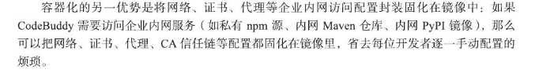

# AI ide使用

随这项目的增加，会出现版本打架的情况

#### **python**

可以将不同版本的.venv   conda    .env放到根目录，IDE会自动扫描，用户也能自己选定

#### Node

可借助  nvm use 命令，结合 .nvmre , .node-version等版本约束

对于高安全需求，多人协作

可在仓库提供dockerfile  /  docker-compose.yml

#### 代码补全与prompt技巧

#### 在学习上，帮你看懂代码

### 团队协作

1. 由核心成员使用  craft  生成项目基础架构，创建**项目骨架**和**检查点**,把**目录**、**组件库选择**、**后端服务集成**、**基本页面**、**登录**和**权限**等一次性做出来,同时让IDE自动生成检查点;其次把这一批对
话和检查点保留在历史记录里。后续成员加入后,先打开历史记录,找到“初始化后台管理系
统”这条记录,查看当时的需求描述和AI的计划,再在这个上下文里输入“我要多加一个报
表页”“我要把用户管理拆成用户+角色+菜单” -- 这样就能使生成的代码和前面的代码保
持风格一致。

#### 创建项目及指令

在对话框里输入‘  /  ’，其中的

**Create Command:** 可创建指令，可指定名称作为触发关键词，比如daily-report:  表示未来可通过 ”/daily-report”运行该指令，**确定名称**后，会自动生成对应的**命令模板**，及其逻辑创建后会自动绑定该项目

**Subagent:多智能体写作的能力拓展**

        在运行模式上 , Subagent 支持两种典型方式 : 其一 , Agentic模式 , 即 Subagent 可在授权范
围内自主调用工具并推进任务执行 , 适用于需要多步推理或自动化处理的场景 ;  其二 , Manual
模式 , 即Subagent仅在显式指令触发时运行 , 用于替代人工执行某一固定职责 , 适合受控环境或
高风险操作 。

#### 实战：github.com/capwitf/t2w
主要完整的前端的交互(cvs  javascript)