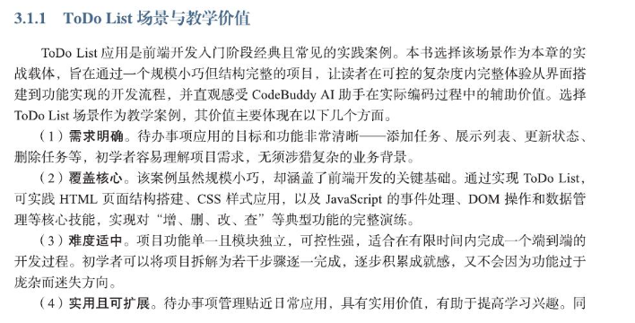

# Hello AI World

TODO  list

1. 交代业务场景 与 教学价值
2. 拆解内部功能模块 ， 将这些模块 与 增删改查 操作以及 HTML / CSS / JavaScript进行对应

对 “要做什么” 和 “要用到哪些能力” 形成任务模型

#### 功能模块与增删改查映射

任务列表展示要确保与数据同步

#### 技术栈与实践路线设计

#### 智能协同节点概述

开发过程适合引入AI协同的节点如下： **结构设计 ， 代码生成 ， 样式调优 ， 逻辑调试与修复 ， 注释生成**

#### 实践步骤

### 自然语言驱动的开放流程

#### prompt

1. 背景信息
2. 界面结构要求
3. 行为逻辑，功能点 : **用条目形式列出要实现的操作行为和交互逻辑**
4. 技术约束 与 限制
5. 代码组织方式
6. 代码风格 与 注释要求 ：代码风格，比如变量名风格

